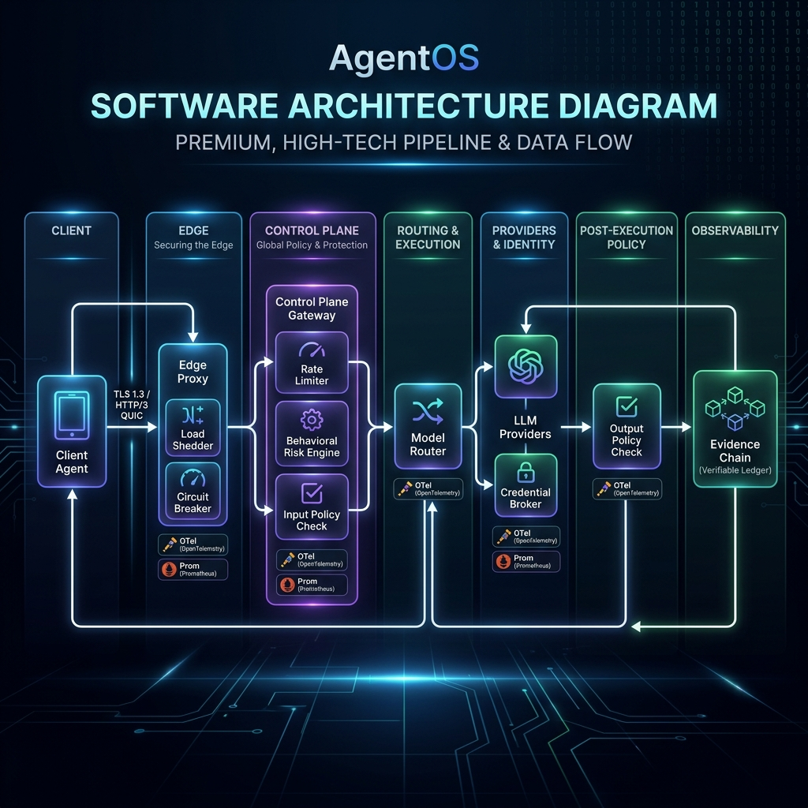
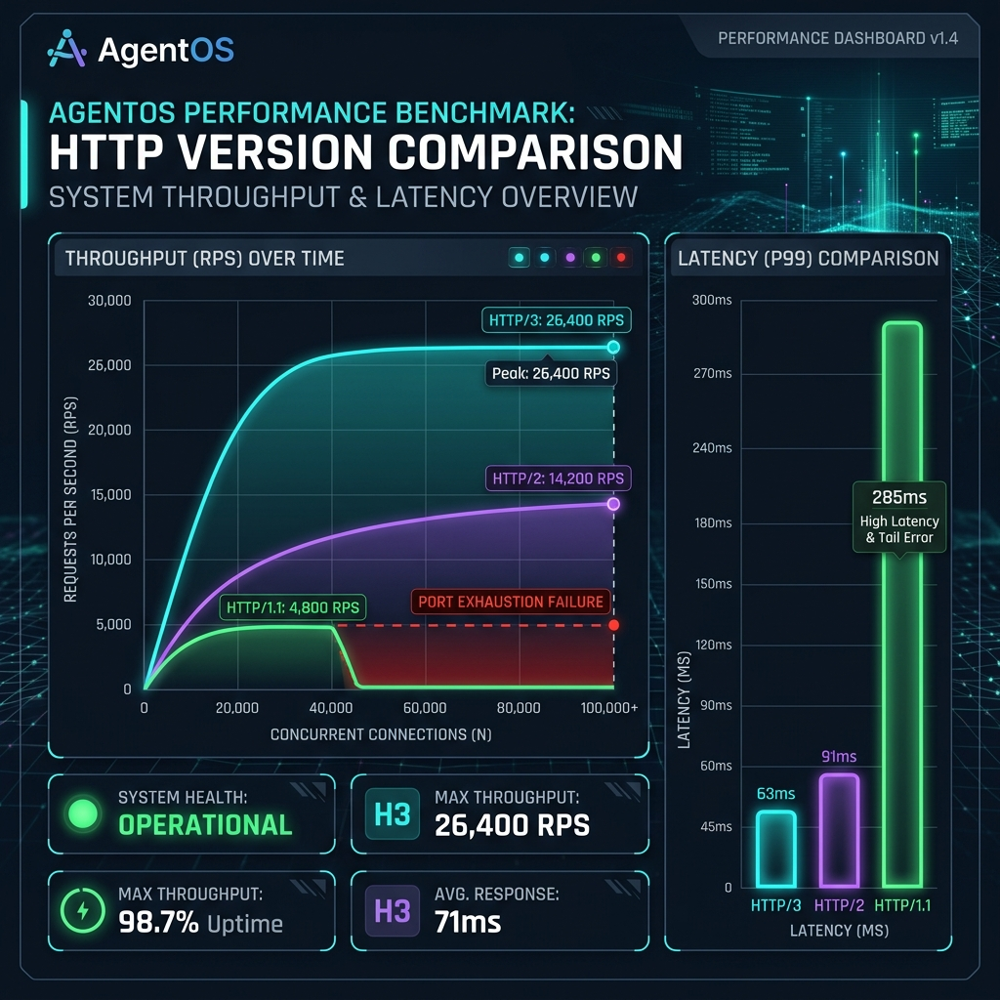
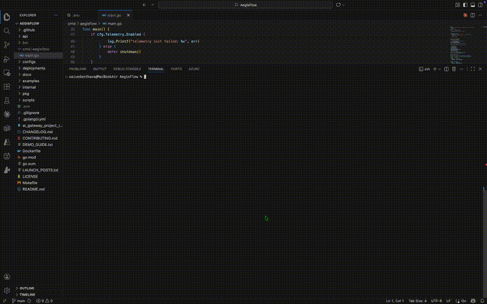

# AgentOS

Runtime Governance Platform for Autonomous AI Agents

[](https://goreportcard.com/report/github.com/rajveer100704/AgentOS)
[](LICENSE)
[](go.mod)
[](https://github.com/rajveer100704/AgentOS/actions)

AgentOS is a high-performance runtime governance platform that sits between autonomous AI agents and the tools, models, and systems they interact with. It provides real-time policy enforcement, task-scoped dynamic credential brokering, distributed tracing, evidence-chain auditing, and human-in-the-loop governance.

---

## At a Glance

- **Runtime Governance** for coding agents
- **HTTP/3 Edge Proxy** with 26k+ RPS
- **Task-Scoped Credentials** brokering
- **Approval Workflows** and review queues
- **Evidence Chain Auditing** (tamper-evident)
- **OpenTelemetry Observability** and metrics
- **Kubernetes Native** deployment

---

## Motivation

Modern coding agents can:
* Open pull requests
* Execute arbitrary shell commands
* Query production databases
* Modify cloud infrastructure

Existing AI gateways focus on LLM routing, latency optimization, and cost tracking.

**AgentOS focuses on runtime governance:** ensuring every agent action is authorized, observable, auditable, and reversible. It operates at the protocol boundary, giving you complete control over agent interactions without modifying the agent's internal reasoning loops.

---

## Architecture



*AgentOS sits between autonomous agents and external systems, enforcing policy, credential boundaries, and auditability at runtime.*

### Core Components

* **Edge Gateway**: Protocol-aware reverse proxy (HTTP/3, HTTP/2, MCP, WebSocket) that intercepts and normalizes all tool calls, database actions, shell executions, and API requests.
* **Policy Engine**: Evaluations layer utilizing keyword blocks, PII filters, regex patterns, and custom WebAssembly (WASM) policy plugins.
* **Credential Broker**: Dynamic broker that mints temporary, task-scoped access tokens (e.g., GitHub App JWTs, AWS STS tokens, Vault credentials) instead of exposing static developer keys.
* **Evidence Chain**: Append-only audit logging engine that constructs cryptographically hash-chained evidence files, rendering tamper-evident session manifests.
* **Approval System**: Interactive review queues utilizing `agentctl` or integrations like Slack and GitHub PR comments for human verification.
* **Observability Stack**: Native OpenTelemetry distributed tracing and Prometheus metric exporters to analyze agent performance and system overhead.
* **Kubernetes Operator**: Reconciles custom resources (Gateways, Providers, Routes, Tenants, Policies) for declarative cloud-scale deployments.

For detailed design specs, see [docs/ARCHITECTURE.md](docs/ARCHITECTURE.md).

---

## Benchmarks

AgentOS's edge engine is built in Go and optimized for extremely low-latency proxying and governance checks.

* **HTTP/3 (QUIC)**: **26,434 RPS** (P99 63ms)
* **HTTP/2**: **14,265 RPS** (P99 91ms)

*Hardware: AMD Ryzen 5 7530U, Go 1.26, 1000 concurrent streams.*



### Governance Pipeline Latency (Microbenchmarks)

Under strict enforcement, the processing latency added by AgentOS to each action envelope is minimal:

| Scenario | p50 | p95 | Ops/sec |
|:---|:---|:---|:---|
| Envelope creation | ~0.4 μs | ~0.5 μs | 2.5M+ |
| Policy evaluate — allow (20 rules) | ~1.2 μs | ~1.5 μs | 847K+ |
| Policy evaluate — block (20 rules, no match) | ~0.7 μs | ~1.0 μs | 1.4M+ |
| Evidence chain record only | ~2.8 μs | ~3.5 μs | 357K+ |
| Policy + evidence chain | ~3.4 μs | ~4.5 μs | 296K+ |
| Full allow (policy + evidence + credential) | ~5.2 μs | ~7.0 μs | 194K+ |
| Review path (policy + queue submit) | ~1.3 μs | ~1.8 μs | 779K+ |
| Envelope SHA-256 hash | ~1.3 μs | ~1.7 μs | 749K+ |

For complete test profiles, refer to [docs/PERFORMANCE.md](docs/PERFORMANCE.md) and [docs/BENCHMARKS.md](docs/BENCHMARKS.md).

---

## Demo



Run the governance demo locally to see allow/review/block execution flows:

```bash
# Start AgentOS with demo config
make run CONFIG=configs/demo.yaml

# In another terminal, run the interactive demo CLI script
./scripts/demos/demo.sh
```

---

## Underlying Infrastructure Layer

Underneath the governance controller, AgentOS operates a high-performance proxy gateway that supports standard routing, security, and optimization capabilities:

* **Intelligent Routing**: Priority-based fallback chains, round-robin, and canary deployments.
* **PII & System Prompts**: Inline PII masking and team-wide system prompt injection.
* **Semantic Caching**: Cosine-similarity-based embedding cache to optimize provider costs.
* **Adaptive Load Shedding**: Sliding-window rate limiting and three-tier traffic shedding.

For details, see [docs/FEATURES.md](docs/FEATURES.md).

---

## Quick Start

### Start Here: Governed PR Writer

Configure a secure boundary around an agent so it can edit code and create PRs, but cannot merge to main, deploy, or execute hazardous commands:

```bash
# Clone the repository
git clone https://github.com/rajveer100704/AgentOS.git
cd AgentOS/starter-kit

# Run the automated developer kit installer
./install-pr-writer.sh
```

The installer builds the binaries, initializes a local policy boundary, runs diagnostics, and guides you on hooking it up to agents:
* [Claude Code Setup](starter-kit/editors/claude-code.md)
* [Cursor Setup](starter-kit/editors/cursor.md)
* [PR Writer Quickstart Guide](starter-kit/QUICKSTART_PR_WRITER.md)
* [Execution Proof Walkthrough](docs/PR_WRITER.md)

For manually deploying the server and testing the edge proxy locally, refer to [docs/GETTING_STARTED.md](docs/GETTING_STARTED.md).

---

## Documentation Links

* **System Architecture & Trust**: [System Design](docs/ARCHITECTURE.md) | [Threat Model](docs/THREAT_MODEL.md) | [System Limitations](docs/SYSTEM_LIMITATIONS.md)
* **Getting Started**: [Quickstart](docs/GETTING_STARTED.md) | [Troubleshooting Guide](docs/TROUBLESHOOTING.md) | [PR Writer Sandbox Walkthrough](docs/PR_WRITER.md)
* **Operations**: [Production Checklist](docs/PRODUCTION_CHECKLIST.md) | [Operations Runbook](docs/OPERATIONS_RUNBOOK.md)
* **API & Integration Guide**: [Configuration YAML](docs/CONFIGURATION.md) | [REST & Admin APIs](docs/API_REFERENCE.md) | [WASM Policy Guide](docs/WASM_PLUGIN_GUIDE.md) | [Roadmap](docs/ROADMAP.md)

---

## Contributing

We welcome contributions. Please refer to [CONTRIBUTING.md](CONTRIBUTING.md), [CODE_OF_CONDUCT.md](CODE_OF_CONDUCT.md), and [MAINTAINERS.md](MAINTAINERS.md) for guidelines.

---

## License

AgentOS is licensed under the [Apache License 2.0](LICENSE).

---

## Acknowledgments

Built using these high-performance open-source projects:
* [chi](https://github.com/go-chi/chi) — Light, fast Go HTTP router
* [Zap](https://github.com/uber-go/zap) — Structured, blazing fast logger
* [wazero](https://github.com/tetratelabs/wazero) — Zero-dependency WebAssembly runtime for Go
* [OpenTelemetry Go](https://github.com/open-telemetry/opentelemetry-go) — Instrumentation and distributed tracing framework
* [graphql-go](https://github.com/graphql-go/graphql) — GraphQL schema executor for Go
* [Prometheus Client](https://github.com/prometheus/client_golang) — Prometheus metrics collector
