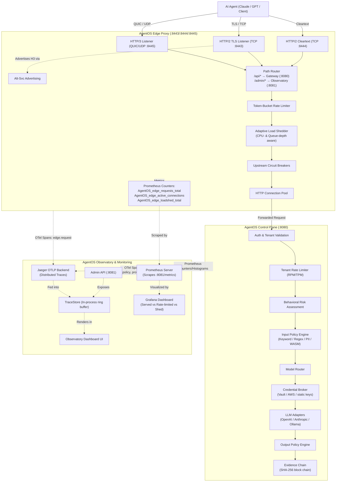
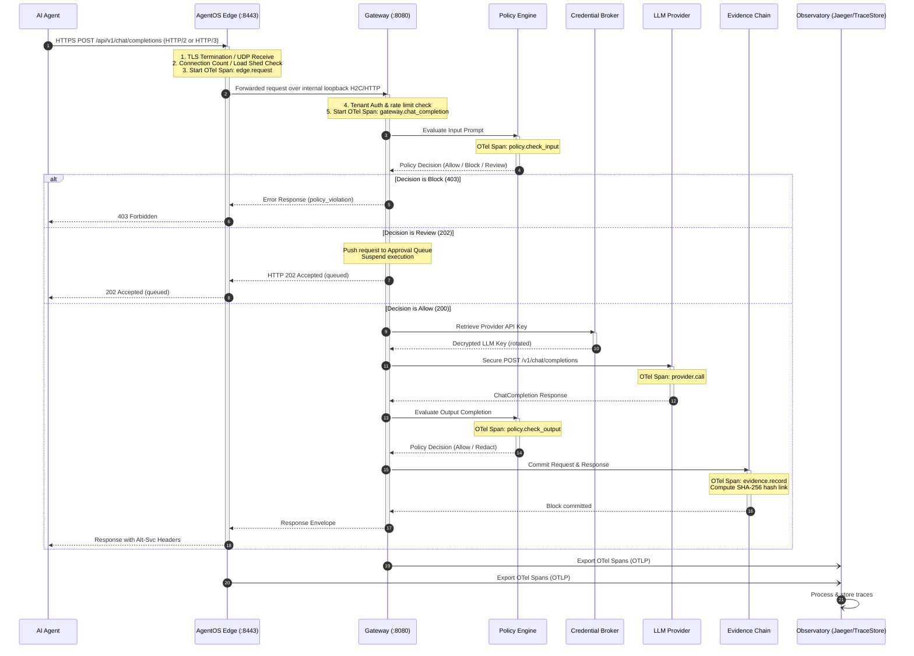

# AgentOS Architecture Design Document

AgentOS (formerly AgentOS) is a production-grade AI agent governance and high-performance edge infrastructure platform. It sits between AI agents (e.g. Claude, GPT, Custom Agents) and the tools/LLM providers they interact with. It acts as an intercepting gateway to enforce access control policies, rotate LLM keys, log tamper-proof evidence, and distribute traces.

---

## High-Level Architecture Flow

The following diagram details the flow of a request from an AI Agent through the Edge Proxy, Control Plane, Policy Engine, Credential Broker, and Evidence Chain. It showcases the integration of HTTP/3, OpenTelemetry (OTel), Prometheus, Grafana, and Jaeger.

---

## 3-Layer Infrastructure Architecture

AgentOS is organized into three decoupled logical layers to optimize performance, scalability, and security:

### 1. AgentOS Edge Proxy Layer
*   **Purpose:** Highly-optimized traffic management, protocol termination, and boundary reliability.
*   **Protocols:** Supports HTTP/1.1, HTTP/2 (via ALPN and H2C), and HTTP/3 (over QUIC/UDP).
*   **Key Responsibilities:**
    *   **TLS 1.3 Termination:** Modern, secure cryptography using ECDSA P-256 / X25519.
    *   **Alt-Svc Advertisement:** Automatically injects `Alt-Svc: h3=":8445"; ma=86400` headers on HTTP/2 responses to allow seamless client upgrades to QUIC.
    *   **Adaptive Load Shedding:** CPU-aware and Queue-depth-aware request rejection. Drops low-priority requests during spikes while guaranteeing throughput for critical requests (marked by `X-Priority: critical`).
    *   **Circuit Breaking:** Independent circuit breakers per upstream target (e.g. gateway, admin API). Trips when error rates spike, protecting downstreams from cascading failure.
    *   **OTel Span Injection:** Generates the outer `edge.request` span, mapping client handshake overhead and upstream response latency.

### 2. Control Plane Layer
*   **Purpose:** Fine-grained API key validation, security policy enforcement, routing, and trust verification.
*   **Key Responsibilities:**
    *   **Tenant Authentication & Rate Limiting:** Exposes custom rate limit ceilings per tenant, enforcing Request-Per-Minute (RPM) and Token-Per-Minute (TPM) limits early in the request chain.
    *   **Input/Output Policy Engine:** Evaluates prompts and completions against keyword lists, regular expressions, PII patterns, and custom WASM sandbox modules.
    *   **Model-to-Provider Router:** Decouples requested models (e.g., `smart`, `fast`) from actual backend providers (OpenAI, Anthropic, Ollama, Mock).
    *   **Credential Broker:** Resolves, rotates, and injects LLM API credentials securely at request time (using Vault, AWS STS, or static environments), ensuring agents never touch raw API keys.
    *   **Evidence Chain:** Creates a cryptographically linked ledger (SHA-256 chain) of request/response envelopes, providing non-repudiation and immutable logging for audit.

### 3. Observatory & Analytics Layer
*   **Purpose:** Real-time system monitoring, distributed trace visualization, and manual governance controls.
*   **Key Responsibilities:**
    *   **TraceStore:** In-process 500-trace ring buffer implementing the OpenTelemetry `SpanProcessor` interface. Enables immediate, zero-dependency trace explorer lookup inside the dashboard without requiring a Jaeger database.
    *   **Jaeger Integration:** Long-term OTLP trace backend integration for structural trace analysis.
    *   **Grafana Dashboards:** Visual representation of requests served, rate-limited, and shed, coupled with active connection gauges, circuit breaker status timelines, and P95 latency buckets.
    *   **Human-in-the-Loop Approvals:** Holds high-risk requests (e.g. commands to delete tables or execute code) in a suspended state until manually approved by an operator via the Admin API.

---

## Detailed Request Lifecycle

## Trace Span Topology

Each transaction is tracked end-to-end under a single trace ID, propagating the following hierarchy:

*   `edge.request` [Edge Layer]
    *   `gateway.chat_completion` [Control Plane]
        *   `policy.check_input` [Policy Engine]
        *   `provider.call` [LLM Layer]
            *   `provider.openai` / `provider.anthropic` / `provider.ollama` (dependent adapter span)
        *   `policy.check_output` [Policy Engine]
        *   `evidence.record` [Evidence Chain]
