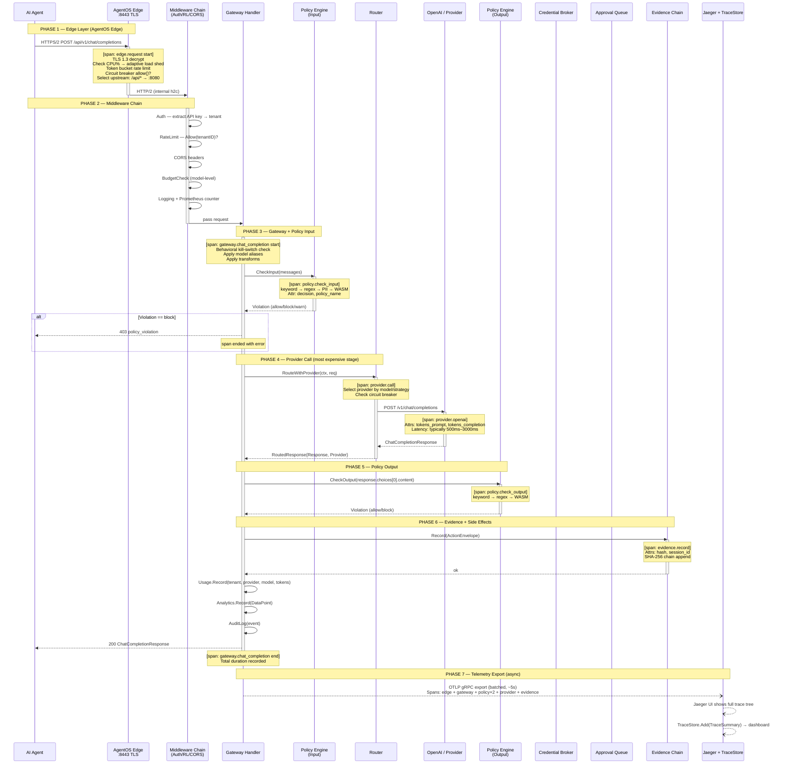
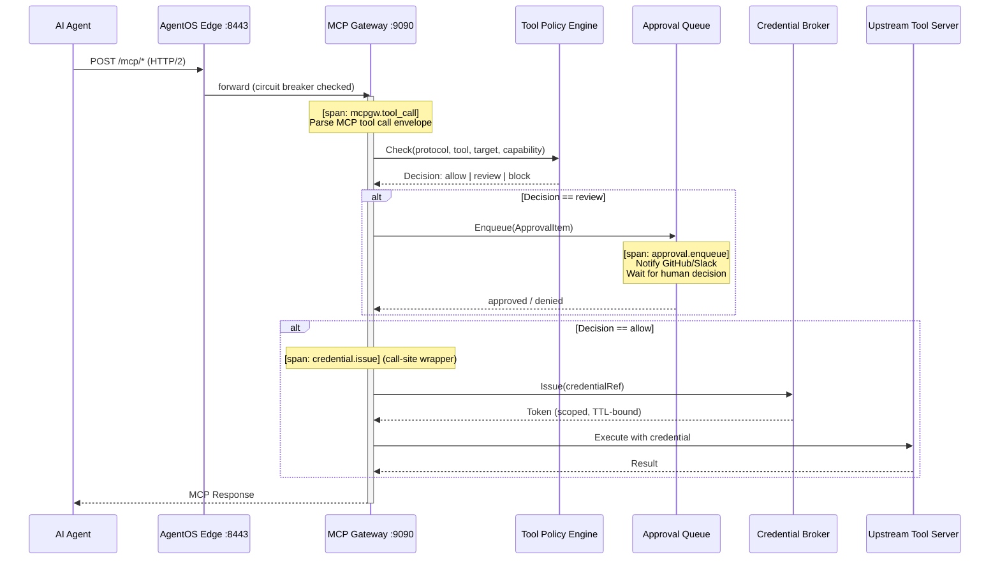

# AgentOS — End-to-End Sequence Flow

## Full Request Lifecycle

This document traces every request from the AI agent through to evidence recording, showing which OTel spans are emitted at each stage.



---

## MCP Tool Call Flow



---

## Span Inventory

| Span Name | Emitted By | Key Attributes |
|-----------|------------|----------------|
| `edge.request` | edgeproxy/proxy.go | `http.method`, `http.url`, `upstream`, `status_code` |
| `gateway.chat_completion` | gateway/handler.go | `tenant_id`, `model`, `stream` |
| `policy.check_input` | gateway/handler.go (wrapper) | `decision`, `policy_name`, `action` |
| `provider.call` | gateway/handler.go (wrapper) | `provider`, `model`, `latency_ms` |
| `provider.openai` | gateway/handler.go (wrapper) | `tokens_prompt`, `tokens_completion`, `tokens_total` |
| `provider.anthropic` | gateway/handler.go (wrapper) | same as openai |
| `provider.ollama` | gateway/handler.go (wrapper) | same as openai |
| `policy.check_output` | gateway/handler.go (wrapper) | `decision` |
| `evidence.record` | gateway/handler.go (wrapper) | `hash`, `session_id` |
| `mcpgw.tool_call` | mcpgw (call-site) | `tool`, `target`, `capability`, `decision` |
| `approval.enqueue` | mcpgw (call-site) | `approval_id`, `tool`, `timeout` |
| `credential.issue` | mcpgw (call-site) | `credential_name`, `ttl`, `scope` |

---

## Latency Budget (Typical)

```
edge.request              total: ~1350ms
├── edge overhead              5ms   (TLS + routing + metrics)
├── gateway.chat_completion  1345ms
│   ├── policy.check_input      3ms
│   ├── provider.call         1330ms
│   │   └── provider.openai   1330ms  ← usually 95%+ of total
│   ├── policy.check_output     4ms
│   └── evidence.record         2ms
```

P95 latency is dominated entirely by the upstream LLM provider.
